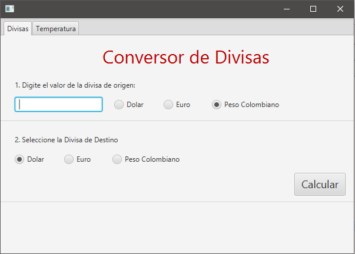

# JavaFx-Conversor

Para el siguiente Taller puede utilizar el archivo ```.fxml``` como referencia que se encuentra en este repositorio.



Siga los pasos a Continuación.

# Pasos:

1. Cree un nuevo proyecto Netbeans como se muestra a continuación.
  //img 0
  //img 1

2. Ejecute el programa y verifique el ejemplo JavaFx muestra la siguiente ventana.
  //img 2

  _Nota:_ Si al ejecutar el proyecto presenta algun error, sobre el proyecto de netbeans haga click derecho y luego propiedades y configure el proyecto de la siguiente manera:
  //img 3

3. Desde el Scene builder modifique el archivo .fxml del proyecto Netbeans para que se paresca a la siguiente interfaz:
  //img 4
  Se recomienda utlizar la siguiente jerarquia de componentes:
  //img 5
  Los radio button estan contenidos en un componente llamado Group. En dicho grupo es posible obtener el boton seleccionado (recuerde seleccionar un solo boton como predeterminado).
  Recuerde asignarle 

4. A continuación asigne los fxid´s correspondientes a todos los componentes como botones, labels, radio button, group. Recuerde utilizar nombres coherentes al proposito de dichos componentes gráficos.

5. Desde el scene builder genere el codigo base del controlador (View/Show Sample Controller Skeleton), copie los nombres de los componentes y peguelos en el controlador del proyecto de netbeans.
  //img 6 
  //img 7
  _Nota:_ verifique en el Scene Builder que la interfaz este relacionada al controlador como se muestra a continuacion

6. En en Scene builder asigne al boton el handler ```handleCalcularDivisa``` y luego en Netbeans en el controlador cree el siguiente evento de código:
  ```
  @FXML
  private void handleCalcularDivisa(ActionEvent event) {

  }
  ```
7. En dicho método implemente la funcionalidad de conversion de un valor escrito por el usuario en el textBox y la selección de Dolar/Euro/Peso. Para lo cual puede usar la siguiente escala de referencia
  - Un Dolar es 0.90 Euros o 3423 Pesos
  - Un Euro es 1.1 Dolares o 3809 Pesos
  - Un Peso es 0.00029 Dolares o 0.00026 Pesos
  
  Para conocer el valor de un grupo puede utilizar el siguiente fragmento de código (recuerde que tanto el grupo como los radio buttons deben tener un fxid):
  ```
  if(grupo.getSelectedToggle().equals(radio_button)){
  
  }
  ```
  El resultado de proceso debe ser mostrado en un label en la parte inferior de la ventana.
  
8. Ejecute el programa y pruebe su funcionamiento.

9. En la segunda pestaña ejecute el mismo proceso para crear en la segunda pestaña un conversor de tempratura:
  //img 8
  Para lo cual siga la siguiente referencia:
  - 1 grado C es igual a 33.8 grados F o 274.15 grados K
  - 1 grado K es igual a -457.87 grados F o -272.15 grados C
  - 1 grade F es igual a -17.2 grados C o 255.9 grados K
  Para realizar este proceso se sugiere manejar este enveto mediante un nuevo handler (se debe incluir el handler en el mismo controlador). 
  
